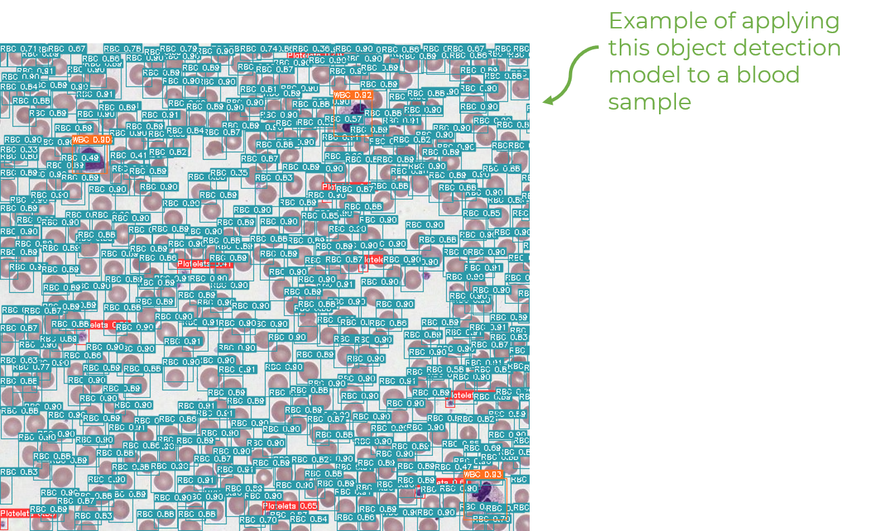

# Peripheral-Blood-Deep-Learning

## Object Detection

The first stage involves training a YOLOv5s object detection model on BCCD dataset. This is model is then successively applied on slices of larger blood sample images with SAHI. The white blood cells - being the primary focus - are then cropped out.

## Classfication

This second stage involves training a ResNet34 classifer on Acevedo white blood cell dataset. It will then be fed the cropped-out white blood cells from the object detection stage for classification.

## Feature Extraction

This third stage involves... (TBA)

